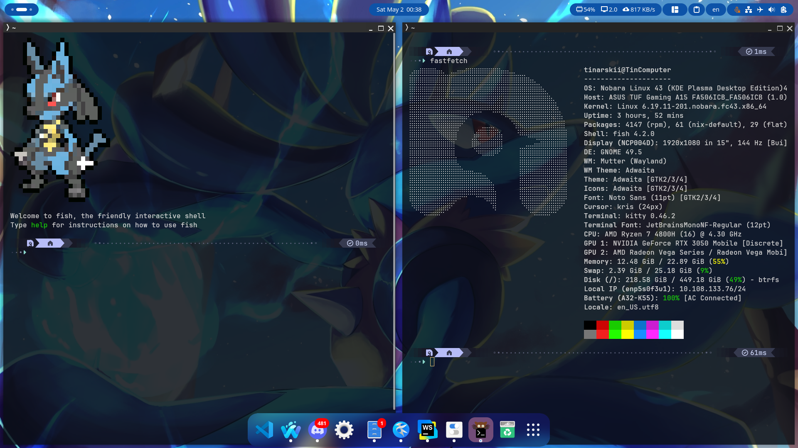

# tinarskii's dotfiles

hello this is where the dots go feel free to fork idk 



## System
- Nobara 43 (official distribution)
- GNOME 49

## GNOME Extensions

- `copyous@boerdereinar.dev`
- user-theme@gnome-shell-extensions.gcampax.github.com
- blur-my-shell@aunetx
- dash-to-dock@micxgx.gmail.com
- Vitals@CoreCoding.com
- just-perfection-desktop@just-perfection
- compiz-windows-effect@hermes83.github.com
- tilingshell@ferrarodomenico.com
- openbar@neuromorph

## Requirements

- fish
- omf
- pokemon-colorscripts 
- gnome-extensions
- gnome-tweaks
- kitty
- starship

## Setup

- install [chezmoi](https://www.chezmoi.io)
- let me ask [claude](https://www.facebook.com/narze/posts/pfbid0nvxX7zjasPZn7LjVsttvDk9cJHXr54R8Knnx6QDCn6TX8N4k42qA94VHw2g3pKCQl) idk 

```
chezmoi init https://github.com/tinarskii/dotfiles
chezmoi apply
```

## Wallpapers

i used to have plenty but because i love lucario too much i ended up abandoned other ones and use `./wallpapers/lucario-desktop-bg.jpg`. if u want to old wallpapers are still in `/wallpapers` dir, they're supposed to be a slideshow. also i disabeld the kitty background (lucario) you can use it by uncommenting the first line of `kitty.conf` file


